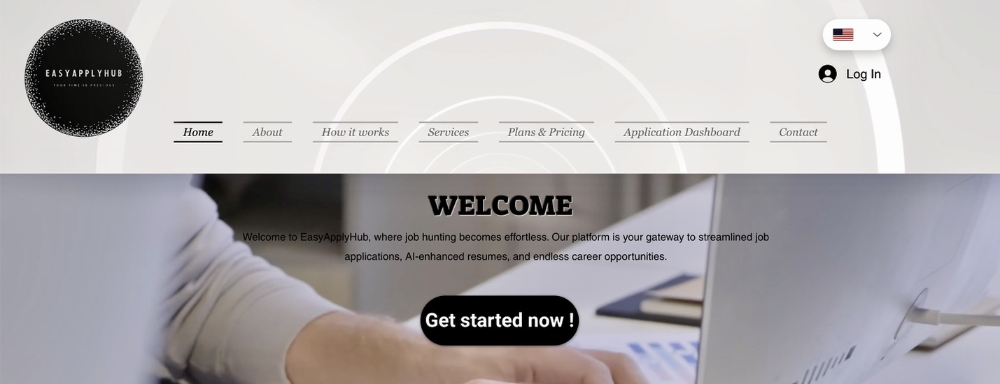

# Auto Apply App
python app to automate search and apply for jobs. 



**🌐 Visit our website: [EasyApplyHub](https://samidhiabx.wixsite.com/easyapplyhub)**

## Features
- [x] user authentication 
- [x] job search 
- [x] apply for jobs

## Prerequisites
- python3
- pip


## Installation
1. clone the repo
```bash
git clone https://github.com/samidh93/AutoApplyApp.git
```
2. create a virtual environment
```bash
python3 -m venv venv
```
3. activate the virtual environment
```bash
source venv/bin/activate
```    
4. install dependencies
```bash
pip install -r requirements.txt
```

## run the app as server
```bash
python3 main.py
```
or 
```bash
uvicorn main:app --reload --host 0.0.0.0 --port 8000
```
or from the script
```bash
bash runFastApiServer.sh
```
after starting the server, open the browser and go to http://localhost:8000/docs to see the API documentation

### Apis
POST apis are used to send data to the server and trigger the required action like login, search for jobs or apply for jobs
GET apis are used to retrieve data from the server like getting a list of all jobs found during the search or getting a list of all jobs applied to.

- /api/job/search/  POST  JobSearchRequest  search for jobs
- /api/job/search/jobs_found  GET  None  get a list of all jobs found during the search
- /api/job/search/jobs_searched  GET  None  get a list of all jobs searched 
- /api/job/apply/  POST  ApplyRequest  apply for a job
- /api/job/apply/jobs_applied  GET  None  get a list of all jobs applied to
- /api/job/apply/jobs_applied  GET  None  get a list of all jobs applied to
- /api/platform/linkedin/verify/  POST  LinkedinCredRequest  verify a linkedin credential
- /api/platform/linkedin/cookies  GET  None  get the cookies of the linkedin session
- /api/platform/linkedin/cookies  GET  None  get the cookies of the linkedin session

## run the app as script
if you want to run the app directly, not through the server, run the following command:

create a copy of the json file, input/sample_user.json, and fill in the details, then run the following command
```bash
python3 appCLI.py --json-file input/your_user.json --login-linkedin --jobs-search --jobs-apply
```
the options are:
- --json-file: 

the path to the json file (required):
the json file should be in the folder input/
the json file is used to configure the app
make sure the json file is fully configured
- --login-linkedin: 

use login command to login to linkedin (required only once), then the app will keep the session alive using the cookie file.
- --jobs-search: 

use jobs-search command to search for jobs. the jobs are stored inside jobApp/data as csv file. 
- --jobs-apply: 
use jobs-apply command to apply for jobs saved inside jobApp/data as csv file. if the jobs are already applied, the app will not apply for them again. the app will update the csv file with the new status of the job.

## user json file
here is the most of the important fields in the json file:
- user: contains the credentials to login to the platform
- search_params: contains the parameters to search for jobs
- candidate: contains the candidate information to apply for jobs

### user
- email: the email of the user
- password: the password of the user
- otp_link: the otp to login to the platform
- owner: the owner of the user
- field_id: the field id of the user
- platform: the platform of the user
- created_date: the date of the user

### search_params
- job: the job to search for
- location: the location to search for the job
- limit: the number of jobs to search for
- work_type: the work type to search: onsite, remote and hybrid
- posted_date: the job posted date, last-day, last-week and last-month
- job_type:  fulltime, parttime, contract, temporary, internship
- easy_apply: easy apply filter, true: enabled, false: disabled

### candidate
- firstname: the first name of the candidate
- lastname: the last name of the candidate
- gender: the gender of the candidate
- resume: the resume of the candidate
- phone_number: the phone number of the candidate
- address: the address of the candidate
- limit: the number of jobs to apply for
- visa_required: the visa required for the job
- years_experience: the years of experience of the candidate
- desired_salary: the desired salary of the candidate
- experiences: the experiences of the candidate
- skills: the skills of the candidate
- field_id: the field id of the candidate
- debug: the debug mode of the candidate
